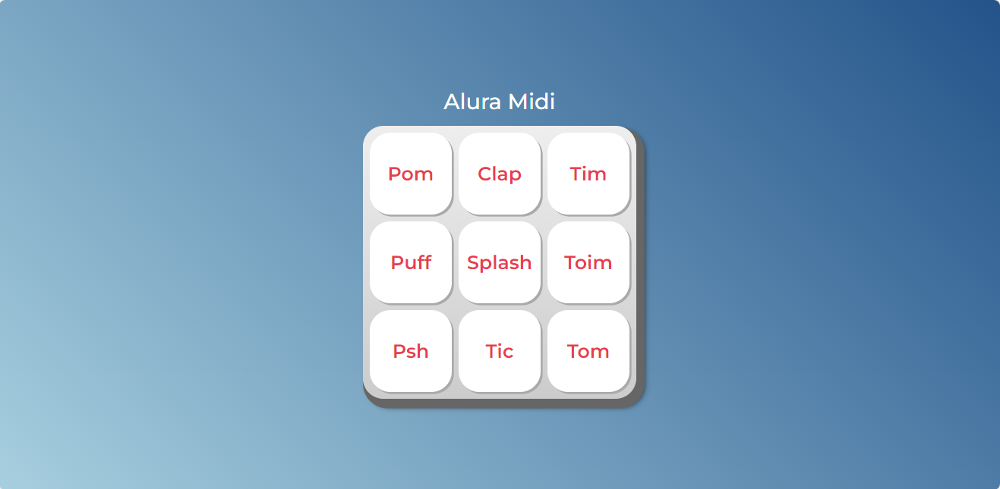

# 
 Pagina do Alura Plus 

* Página desenvolvida através do curso JavaScript para Web

### Ferramentas utilizadas:
* HTML

* CSS

* JavaScript

* Git e GitHub

## Feito por:

### Vinnicius Oliveira Rodrigues

<h4 align="center"> 
    :construction:  Projeto em construção  :construction:
</h4>

### Linkedin: https://www.linkedin.com/in/vinnicius-oliveira-rodrigues-5a373b1a4/